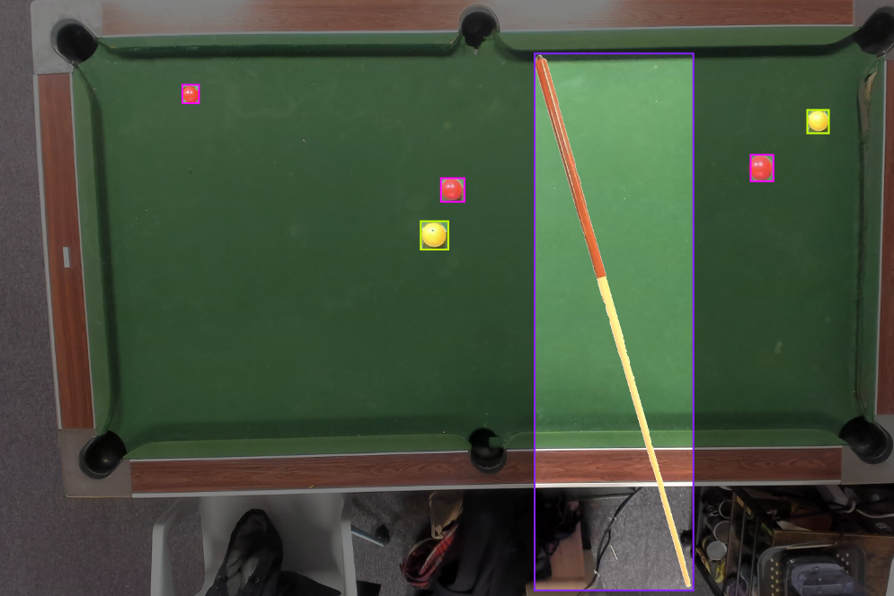
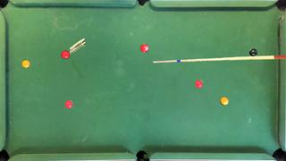

# BallDetectionOnPool

This project consists of customizing a pool data set.
The purpose of this data set is to train a deep learning model that performs balls and cue detection.

In this page, we experiment a pre-trained model using YOLOV5.

  

 

## Data set description

One data set sample is the couple of an image and a label.
* the image is a resized pool frame with objects on it : color balls and cues + obstacles (such as human hands or a bag, to create noise)
* labels list in a .txt file the objects present on the associated image. The label use YOLO Darknet TXT format. See [AlexeyAB comment](https://github.com/AlexeyAB/Yolo_mark/issues/60)

  
  
   
  Sample example : an image and its labels

 

Images are created from saved pool background and saved objects that are cropped and added in random positions on the image.

## Customization parameters

Using this program, it is possible to customize the data set on the [images_generator.py](/images_generator.py)

Customize parameters are:
* classes : choose the classes name you want to label
* train_nb & valid_nb & test_nb : samples number of data set splitted in train, valid & test folder
* size : choose the output size of images
* grayshade (True/False) : make the images in gray shades
* objects quantity on images : in one image, there are a random number of each objects, you can choose the maximum possible quantity of each object.

## Why customizing this data set?

Customizing this data set allows to modify images, classes choices and label elements to experience different deep learning approaches.  
For examples : I trained models with different images sizes to experience the relation between accuracy and speed depending on images size ; I experience red_ball, yellow_ball, ... detection VS ball detection and realised that detecting balls without considering their color was much more effective.

## How to run this program :

`$ git clone https://github.com/BrouBrouz/BallDetectionOnPool`
 
`$ cd BallDetectionOnPool`

To custome the parameters, go in the python file : images_generator.py and change the values
Then, to run the program, type : 
`$ make`

Images will be automatically saved in dataset folder

To display an image with its bounding boxes : `$ make draw`

## How to use pre-trained model YOLOV5 ?

W.I.P.

 
 
